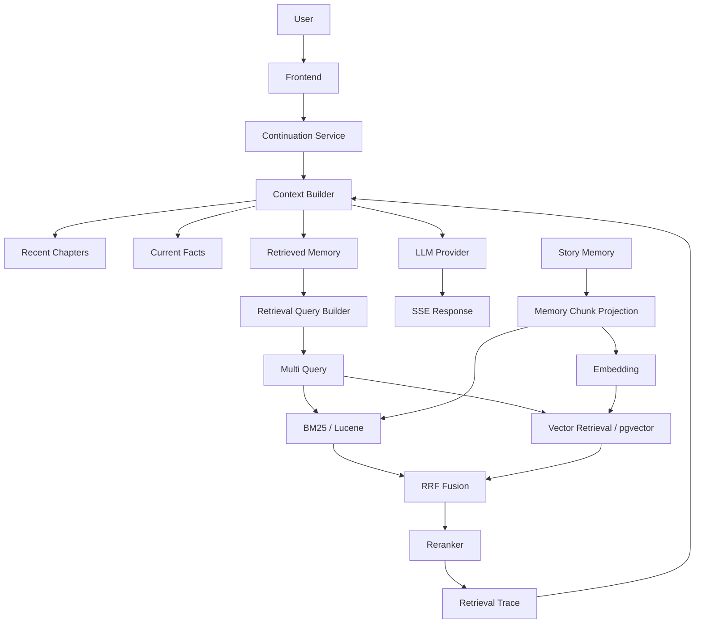

# InkForge

**Long-Form AI Story Continuation & Narrative Memory Engine**
面向长文本生成的 AI 小说续写与叙事记忆系统

InkForge 不是"调用 LLM API 生成小说"。它解决的核心问题是：

> 一部长篇小说（数十万到数百万字）无法完整放入 LLM Context 时，AI 如何**记住**几百章以前的剧情、**检索**出当前真正相关的历史、在有限 Context 下**决定**什么值得进入 Prompt，并**验证**生成内容与原著不冲突。

设计原则：**确定性逻辑负责结构，LLM 负责语义。**

```text
Novel → Parser → Chapter → Story Memory → MemoryChunk Projection
      → Hybrid Retrieval (BM25 + Vector → RRF → Reranker) → Context Budget
      → LLM → Generation → Retrieval Trace → (回到 Story Memory)
```

## 系统架构



记忆构建链路：`章节 → LLM 结构化提取（严格校验 + 重试）→ Story Memory（摘要/人物事实三态/事件）→ MemoryChunk 投影 → Embedding → 检索索引`。

## 当前状态：P1-P3 已完成并封版

| Phase | 内容 |
|---|---|
| **P1** | TXT 解析（GBK/UTF-8）→ 章节切分 → 断点检测 → LLM 续写 → SSE 流式 + GenerationLog |
| **P2** | Story Memory：章节摘要 / 人物事实（CURRENT / SUPERSEDED / UNCERTAIN 生命周期）/ 剧情事件 / 结构化提取校验 / 确定性合并 / ContextSection 预算 |
| **P3** | Hybrid Retrieval：MemoryChunk 投影 + Lucene BM25（中文分词）+ Embedding/Vector（pgvector 可选）+ RRF 融合 + Reranker + MultiQuery + Retrieval Trace（可解释检索）+ 前端 Trace 面板 + **Benchmark 消融实验** |

P4 前端产品化（P4-UI-A 设计系统 → P4-UI-F 响应式/无障碍）已完成并封版；后续 Roadmap 见文末。

## 技术栈

| 层 | 技术 |
|---|---|
| Backend | Java 21 · Spring Boot 4.1 · Maven Wrapper（无需全局安装 Maven）· SSE |
| 检索 | Apache Lucene 9.12.3（BM25 + SmartChineseAnalyzer 中文分词）· pgvector（HNSW 余弦，可选） |
| 存储 | 默认 InMemory（零依赖）· PostgreSQL 16 + pgvector（`postgres` profile 可选） |
| LLM / Embedding | 全接口化 Provider：OpenAI 兼容（DeepSeek/Ollama 等）/ Mock（零 Key 可跑） |
| Frontend | Vite · React · TypeScript（原生 fetch + ReadableStream 解析 SSE，无第三方 SSE 库） |

## Benchmark 摘要（P3-G，详见 [docs/benchmark-results.md](docs/benchmark-results.md)）

固定 12 章中文网文 + 24 条人工标注 Query，零 API Key / 零 Docker 可复现（`./mvnw test -Dtest=RetrievalBenchmarkTest`）。

| Method | Recall@5 (chunk) | Recall@10 (chunk) | MRR@10 (chunk) | NDCG@10 (chunk) |
|---|---|---|---|---|
| baseline（最近 3 章窗口） | 0.090 | 0.090 | 0.104 | 0.074 |
| p2-memory（记忆窗口） | 0.271 | 0.271 | 0.152 | 0.151 |
| bm25 | 0.819 | 0.972 | 0.762 | 0.784 |
| vector（Mock Embedding） | 0.819 | 0.972 | 0.733 | 0.777 |
| hybrid-rrf（BM25+Vector→RRF） | **0.882** | 0.972 | **0.816** | **0.817** |

结论（均限定在本次固定实验条件下）：检索层相对无检索基线 Recall@10 从 0.09→0.97；**RRF 融合带来稳定增益**（Recall@5 +7.7%，MRR@10 +7.1%）；简单拼接、PassThrough Reranker、当前 MultiQuery 策略未产生额外收益——如实记录，未做美化。

## 快速开始

前置要求：**Java 21**、**Node.js 18+**。不要求全局 Maven，不要求数据库，不要求 API Key，不要求 Docker。

### 1. 启动后端（默认 Mock Provider，无需任何 API Key）

```bash
cd backend
./mvnw spring-boot:run        # Windows CMD 用 mvnw.cmd spring-boot:run
```

后端启动于 http://localhost:8080

### 2. 启动前端

```bash
cd frontend
npm install
npm run dev
```

浏览器打开 http://localhost:5173 （Vite 已将 /api 代理到 8080）

### 3. 完整闭环

上传一个 TXT 小说（UTF-8 或 GBK 均可）→ 查看章节列表与断点 → **建立故事记忆**（可选，见右侧 Story Memory 面板）→ 点击「开始续写」→ 实时看到流式生成结果、token/成本统计，以及「📚 参考了 X 条记忆 · 查看检索过程」（可展开查看 BM25/Vector/RRF/Reranker/Final 各阶段检索链路）。

## 切换 LLM Provider

默认 `mock`（内置模拟输出，用于无 Key 的演示与开发）。切换到真实模型只需环境变量：

| 环境变量 | 说明 | 默认值 |
|---|---|---|
| `INKFORGE_LLM_PROVIDER` | `mock` / `deepseek` / `openai` / `ollama` / `openai-compatible` | `mock` |
| `INKFORGE_LLM_API_KEY` | API Key（只从环境变量读取，绝不入库） | 空 |
| `INKFORGE_LLM_BASE_URL` | API 基地址（自动拼接 `/chat/completions`） | `https://api.deepseek.com` |
| `INKFORGE_LLM_MODEL` | 模型名 | `deepseek-chat` |
| `INKFORGE_EMBEDDING_PROVIDER` | `mock` / `openai-compatible`（如 SiliconFlow bge-m3） | `mock` |
| `INKFORGE_EMBEDDING_API_KEY` | Embedding API Key（环境变量） | 空 |

示例（bash / PowerShell 同理）：

```bash
# DeepSeek
export INKFORGE_LLM_PROVIDER=deepseek
export INKFORGE_LLM_API_KEY=sk-xxxx

# OpenAI 兼容服务（任意 base-url）
export INKFORGE_LLM_PROVIDER=openai-compatible
export INKFORGE_LLM_BASE_URL=https://your-endpoint/v1
export INKFORGE_LLM_API_KEY=sk-xxxx

# 本地 Ollama（无需 Key）
export INKFORGE_LLM_PROVIDER=ollama
export INKFORGE_LLM_BASE_URL=http://localhost:11434/v1
export INKFORGE_LLM_MODEL=qwen3:14b
```

可选配置（`backend/src/main/resources/application.yml`）：`inkforge.context.context-max-tokens`（默认 8192，仅为配置默认值）、`inkforge.generation.max-output-tokens`（默认 2048）、`inkforge.retrieval.*`（bm25/vector/fusion/rerank top-k、rrf-k、reranker）、`inkforge.memory.*`（提取预算与窗口）、`inkforge.cost.prices`（成本估算表）。

可选持久化（PostgreSQL + pgvector）：

```bash
docker compose up -d
cd backend
./mvnw spring-boot:run -Dspring-boot.run.profiles=postgres
```

## 隐私与数据处理（Privacy / Data Handling）

InkForge 有两种运行方式，数据处理方式不同：

- **默认 Mock 模式（零配置）**：全部内置模拟，**不会向任何第三方模型服务发送小说内容**。适合零 Key 体验完整流程，但输出不是真实 AI 写作。
- **真实 Provider 模式**：当你配置了真实的 LLM / Embedding Provider（如 DeepSeek、SiliconFlow、OpenAI-compatible 端点或本地 Ollama），**你上传的小说文本、故事记忆与检索片段会发送到你配置的第三方服务**，用于续写、记忆提取与语义检索。具体条款以你选择的服务商为准。

API Key 安全：

- Runtime 配置的 LLM API Key **仅保存在后端内存**：不写入数据库、不出现在任何 API 响应、不被前端回显。
- 后端重启后 Runtime Key 清除（回到环境变量 / 默认值）。
- 请只通过环境变量或本地运行时配置提供 Key，不要提交进仓库（`.env` 已被 gitignore）。

> InkForge 不承诺"数据永不离机"——真实 Provider 模式下显然会发送到第三方。需要完全离线的场景，请使用 Ollama 等本地端点。

## 部署（Deployment）

**定位：Local / Development First。** 当前版本面向单用户本地运行，尚未提供完整生产托管方案。

- **默认 profile（推荐体验）**：InMemory 存储 + Mock Provider，零 PostgreSQL、零 Docker、零 API Key。启动后端即可导入小说体验完整流程。
- **PostgreSQL profile**：`docker compose up -d` + `-Dspring-boot.run.profiles=postgres`，用于持久化小说、Story Memory 与检索数据（pgvector）。
- **生产 / 公网**：当前**不建议**直接把本版本暴露到公网：
  - 无用户认证，Runtime LLM 配置 API 无鉴权（单用户设计）；
  - CORS 按同源开发设计，未针对公网部署加固；
  - 尚未提供容器镜像 / 反向代理 / 生产托管编排。

生产部署（容器化、认证、配置安全）将作为后续独立阶段设计。

## 当前限制

- 默认 `MockEmbeddingProvider` 为确定性 n-gram 伪向量，**仅用于管线验证与零 Key 演示，不代表真实语义质量**；真实语义检索需配置 OpenAI-compatible Embedding（如 bge-m3）
- 默认 `PassThroughReranker` 只做 top-K 截断，**不执行语义重排**；`LlmListwiseReranker` 可配置启用
- 本机未安装 Docker 时，PostgreSQL/pgvector 与 Trace 的集成测试自动 **skipped**（代码已就绪，安装 Docker 后即可执行）
- 一致性校验（Consistency Checker）属于后续阶段，P3 未实现

## 测试

```bash
cd backend
./mvnw test
```

- 当前 **225 tests / 0 failures**（10 个 PostgreSQL IT 在无 Docker 时自动 skipped，如实标记）
- 所有 LLM/Embedding 测试使用 Mock Provider，**不依赖真实 API**
- 覆盖：章节切分（中文网文真实结构 fixture）、Token 预算不变量、Memory 合并规则、检索（BM25/Vector/RRF/Reranker）、Context 集成、Benchmark 消融

## 文档

| 文档 | 内容 |
|---|---|
| [docs/architecture.md](docs/architecture.md) | 总体架构与 Phase 演进路线 |
| [docs/phase2-design.md](docs/phase2-design.md) | Story Memory 设计评审（最终版） |
| [docs/benchmark-results.md](docs/benchmark-results.md) | P3-G 检索消融实验报告 |
| [docs/thesis-material.md](docs/thesis-material.md) | 论文/技术报告材料（系统设计 + 实验） |

## Roadmap

| Phase | 状态 |
|---|---|
| **1** TXT 解析 → 章节切分 → 断点检测 → LLM 续写 → SSE + GenerationLog | ✅ 封版 |
| **2** Story Memory（摘要 / 人物事实三态 / 事件 / 提取校验 / 确定性合并 / ContextSection） | ✅ 封版 |
| **3** Hybrid Retrieval（MemoryChunk + BM25 + Vector + RRF + Reranker + MultiQuery + Trace + 前端面板 + Benchmark） | ✅ 封版 |
| 4 | Context Budget Manager 深化 / Memory 压缩（未开始） |
| 5 | Consistency Checker（人物/时间线/世界观/关系/物品一致性校验）（未开始） |
| 6 | Multi-Branch 生成、Timeline、Event Graph、Style Profile、World Memory（未开始） |
| 7 | 更丰富的记忆管理、更大 Benchmark、真实模型评估（未开始） |

## Current Status — v0.1.0-alpha

> 核心功能已可运行；部署、CI、测试覆盖与部分高级能力仍在持续完善的早期 alpha 版本。

已具备：

- Story Memory（人物事实三态 / 事件 / 摘要 / 未解决线索）✅
- Hybrid Retrieval（BM25 + Vector → RRF → Reranker）✅
- Retrieval Trace（可解释检索 + 前端面板）✅
- Runtime LLM configuration（前端选择模型 / 填 Key，立即生效）✅
- Streaming Continuation + Token / 成本统计 ✅
- Responsive UI（桌面 / 笔记本 / 窄屏 + Drawer）✅
- Reranker abstraction（PassThrough / LLM 可插拔）✅
- Benchmark（固定数据消融实验）✅

当前限制：

- Embedding / Reranker 仍为启动时配置，**不可运行时切换**（Runtime 切换 Embedding 需 re-embedding + 向量索引重建，属未来能力）
- 默认 `MockEmbeddingProvider` 仅用于管线验证，**不代表真实语义质量**
- 默认 `PassThroughReranker` 只做 top-K 截断，**不执行语义重排**
- Benchmark 为固定数据与固定配置的消融结果，非真实模型端到端评估
- PostgreSQL Integration Tests 在无 Docker 的本地环境自动 **skipped**
- 主要面向**单用户本地运行**；尚无认证与多用户能力，不建议直接公网部署

## License

[Apache License 2.0](LICENSE)
